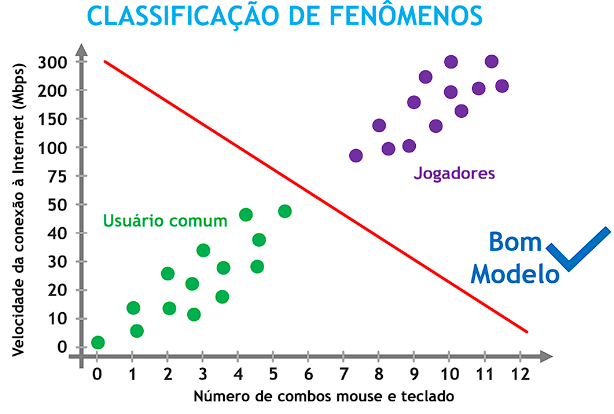

# **modelos matematicos**
## **o que uma maquina aprende?**
  - modelos matematicos que representam a realidade.
  - tem-se o ajuste do modelo(fit) que é a qualdiade da representação em relação aos dados da realidade:
   
  com isso, vamos para os tipos de modelos.
  ## **modelo de previsão**
  - o modelo é uma relação entre variáveis, que podemos expressar matematicamente.
  
  
  ## **modelo de classificação**
  - o modelo de classificação, separa os dados em diferentes grupos para serem relacionados ou não em um grafico de comparação dos resultados.
  
  