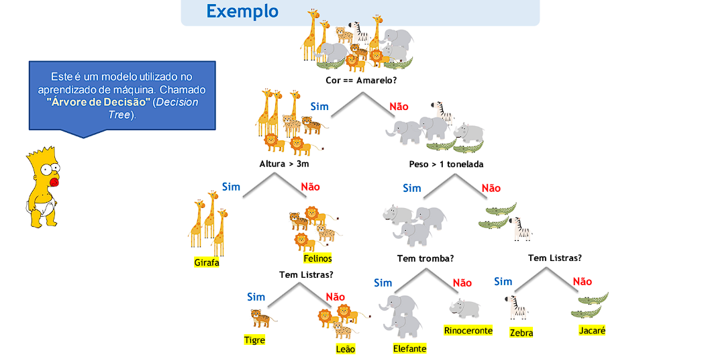
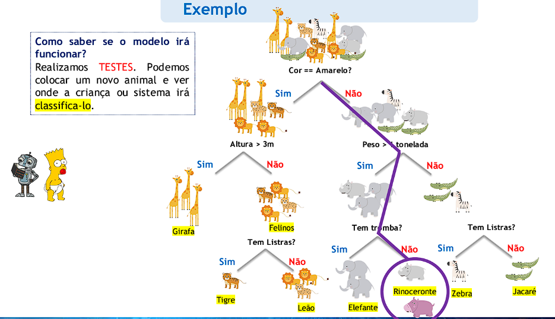
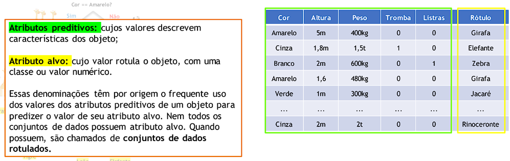

# **Modelos de aprendizado de máquina**

  ## **Arvore de decisão**
  é um modelo de aprendizado de máquina o qual existe uma classificação dos dados, montando assim uma arvore, observe:
  

  com as classificações feitas, precisamos testar a arvore para saber se ela está realmente fucionando, no caso, com dados novos, diferentes dos dados usados para treinamento:

  

  Em geral, os conjuntos de dados são estruturados em formato tabular, uma matriz atributo-valor, em que cada linha representa um objeto (instância ou exemplo) e cada coluna representa um atributo (característica ou variável).

  

  ## **generalização**
  
  É a Propriedade de um modelo continuar a ser válido para novos objetos dá-se o nome capacidade de generalização. Essa capacidade é necessária para que o modelo seja válido para novos dados

  ## correlação x causalidade
  |          Correlação          |                    Causalidade                   |
|------------------------------|---------------------------------------------------|
| Relação estatística entre variáveis | Uma relação causal entre variáveis |
| Mede a interdependência entre elas | É também uma correlação (o inverso não se aplica) |
| Mesmo eventos sem relação de causa podem ter alto coeficiente de correlação | Diferentes tipos |
|                              | Diversos métodos para testar |
|                              | perguntas a ser feitas: inferência causal e descoberta causal |

