# pipeline
  
  O pipeline é um mapa das etapas/fases/operações que compõem um determinado processo.

  no caso da criação de um projeto de ciencia de dados, geralmente temos:

  definição do problema **>** 

  coleta de dados **>** 

  pré-processamento **>** 

  solução do problema **>** 

  modelo **>** 

  avaliação **>** 

  protótipo **>** 

  melhoria

---

  ## **definição do problema**
  - tipo de precição:
    - regressão
    - classificação
    - clusterização

  ### **aprendizagem não supervisionada**
   a aprendizagem supervisionada pode ser usada para os modelos de regressão ou classificação por causa de seus rotulos

  #### **regressão**
   busca relacionar a amostra a um valor por meio de uma função matemática

  #### **classificação**
   busca relacionar a amostra a uma categoria específica
 
 

  ### **aprendizagem não supervisionada**
   é o treinamento e aprendizagem com base em amostras não rotuladas. O agrupamento é uma forma comum de aprendizagem não supervisionada.
   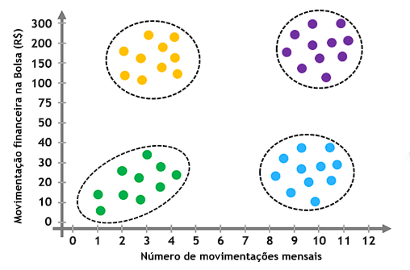

### **aprendizagem por reforço**
- utiliza tentativa e erro para encontrar uma solução para o problema.
- o modelo recebe recompensas(acertos) ou penaldiade(erros) pelas ações que executa
- seu objetivo é maximizar a recompensa total
- o meio ambiente pode mudar, forçando uma adatação as novas condições

a aprendizagem por reforço se destaca nas areas de treinamento dem aquinas autonomas, robos e jogos:

## **visão geral dos algoritmos de aprendizagem de maquina**
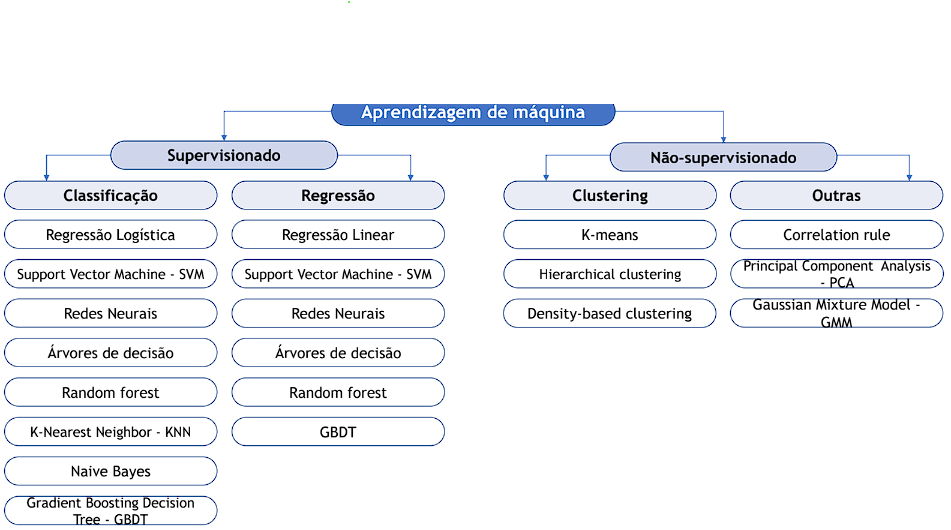

### **regressão linear**
  é o modelo estatistico cujo objetivo é indicar qual será o comportamento de uma variável dependente(y) como uma função que contenha uma ou mais variaveis independentes(x)
  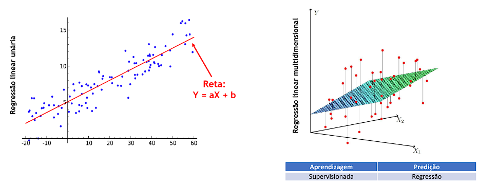
### **regressão polinomial**
  - é uma extensão da regressão linear
  - pode ser usada quando a complexidade de um conjunto de dados excede a possibilidade de ajuste por uma linha reta.

	     hw(x) = w¹x + w²x^2 + ... + wnx^n + b
  - onde, a enésima potência é uma dimensão de regressão polinomial(grau)
  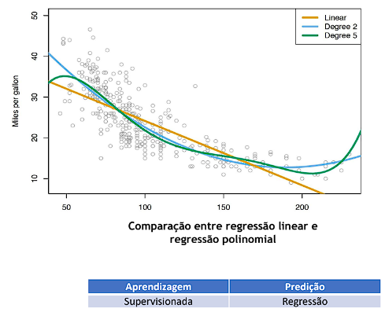

### **regressão logistica**
- o modelo de regressão logistica é usado para resovler problemas de classificação
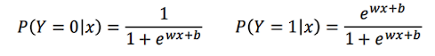
- se aplica apenas a problemas de classificação binária.
- na pratica:
  - se P(Y=0|x) **>** P(Y=1|x) classifica como Y = 0
  - se P(Y=0|x) **<** P(Y=1|x) classifica como Y = 1
  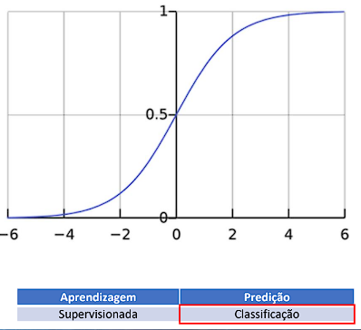

### **Softmax**
- é uma extensão da regressão logística
- a regressão logística se aplica apenas a problemas de classificação binária
- para problemas de classificação com várias classes, usa-se a função softmax
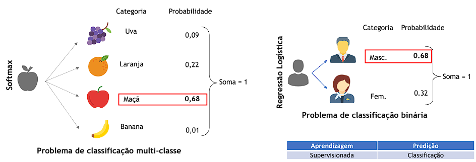

### **K-Nearest Neighbor - KNN**
- o KNN é usado para problemas de classificação
- o modelo busca classificar cada amostra de um conjunto de dados avaliando sua distância em relação aos vizinhos mais proximos
- se os vizinhos mais proximos forem majoritariamente de uma classe, a amostra em questão será classificada nest categoria.
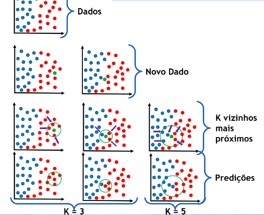

---

## **pre-processamento de dados**
- fase de limpeza de dados
- redução da dimensão dos dados
- normalização de dados

exemplo de um conjunto de dados típico:
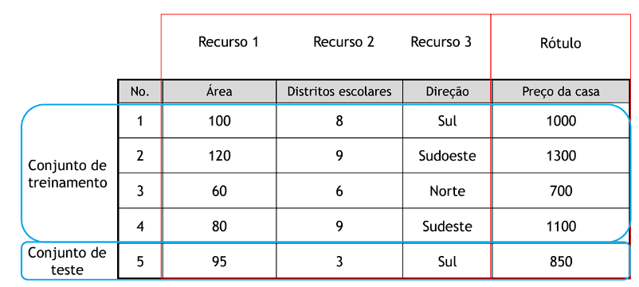

- sem bons dados, não existe um bom modelo

exemplo de tratamento de dados em fase de pre-processamento:
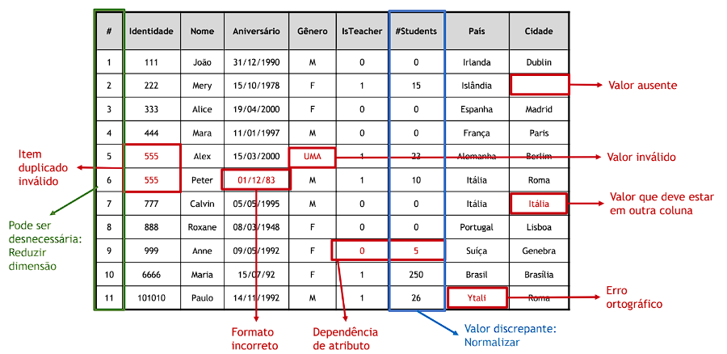

## **extração e seleção de recursos**

- geralmente, um conjunto de dados tem muitos recursos, alguns dos quais podem ser redundantes ou irrelevantes para o valor a ser previsto
- a seleção de dados é necessária nos seguintes aspectos:
  - reduz o tempo de treinamento
  - evita a explosão da dimensão
  - melhora a generalização do modelo e evita overfitting
  - simplifica os modelos para torná-los fáceis de dserme interpretados pelos usuários

## **treinamento de modelo**

a fase pelo qual nosso modelo passa a ser executado usando a base de dados de treinamento, com dados tratados

## **avaliação do modelo**
- analisar a capacidade de generalização do modelo:
  - o objetivo da aprendizagem de maquina é que o modelo obtido apos o aprendizado tenha um bom desempenho em novas amostras, não apenas em amostras usadas para treinamento
  - a capacidade de aplicar um modelo a novas amostras é chamada de generalização ou robustez
  - por isso dividimos os dados em conjunto de dados de treinamento e conjunto de dados de testes
    - é comum a divisão do conjunto de dados em 80/20 para treinamento e testagem do modelo.

### **validação cruzada**
é aqui que entra a validação cruzada pois, por vezes a divisão 80/20 não será suficiente para fazer a correta modelagem do algoritmo, nesse caso, utilizamos a k-fold cross-validation, ou validação cruzada dos dados.
- o conjunto de dados é dividido aleatoriamente em "K" grupos
  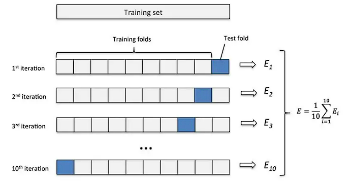
