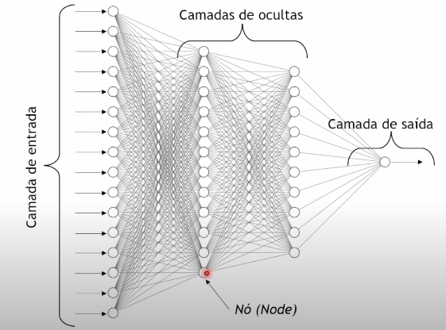
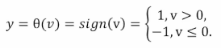
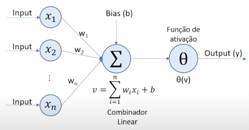
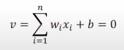
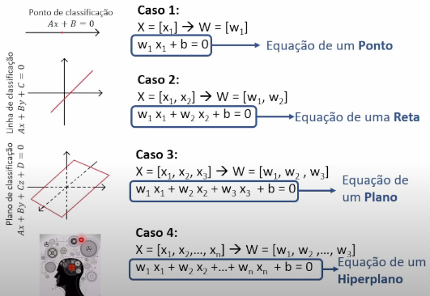
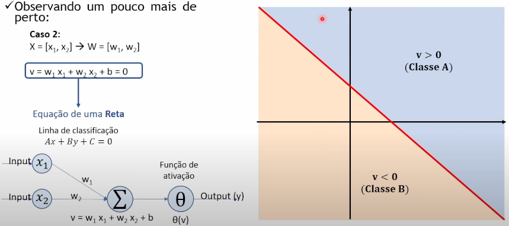

# **Deep Learning**
## o que é?

é uma parte dentro da area de machine learning mais avançada, onde seus algoritmos são baseados em redes neurais, que aprendem a partir de vasta quantidade de dados, aliados ao crescente pdoer computacional atual.

## machine learning tradicional x deep learning
|                     | Machine Learning Tradicional | Deep Learning            |
|---------------------|------------------------------|--------------------------|
| Requisitos de Hardware | Baixos                       | Elevados                 |
| Treinamento com quantidade limitada de dados | Sim                | Não                      |
| Desempenho melhora com aumento de dados | Não               | Sim                      |
| Discriminação de problemas | Nível a nível            | Aprendizagem Fim a Fim    |
| Seleção manual de recursos | Sim                   | Não                      |
| Explicabilidade dos recursos | Fácil                | Difícil                   |

## **como funciona a deep learning?**
- A arquitetura em deep learning geralmente é uma rede neural profunda
  - o termo "profunda" em "deep learning" refere-se ao número de camadas da rede neural

### **Definição de rede neural**
é um sistema computacional de processamneto de informações, composta por elementos altamente interconcectados, projetado para imitar a estrutura e funções do cérebro humano.

## **perceptron de camada unica**
- vetor de entrada: X = [x1,x2,...,xn]
- pesos(weights): W = [w1,w2,...,wn]
- Bias: b
- Função de ativação:
- 
- O perceptron uma camada é um classificador binário, por exemplo:
  - se y = 1, resultado Classe A
  - se y = -1, resultado Classe B
- 

perceba que na função de ativação toda a classificação ocorre em relação ao valor 

- analisando então v=0
- 
  - vamos analisar alguns casos para X = [x1,x2,...,xn]
   
  - 
- **perceptrons de camada unica não conseguem resolver problemas não lineares**
  - por isso, criou-se os perceptrons de multi-camadas, onde no exemplo acima, é criado uma nova linha

-**!EXISTEM VARIOS TIPOS DE FUNÇÕES DE ATIVAÇÃO!**