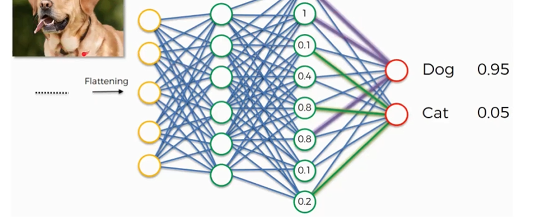
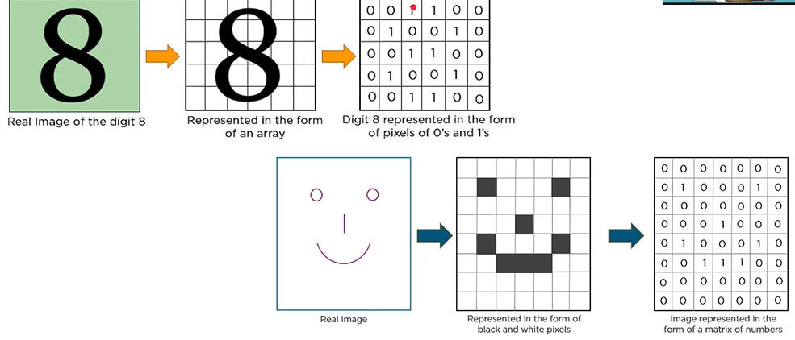
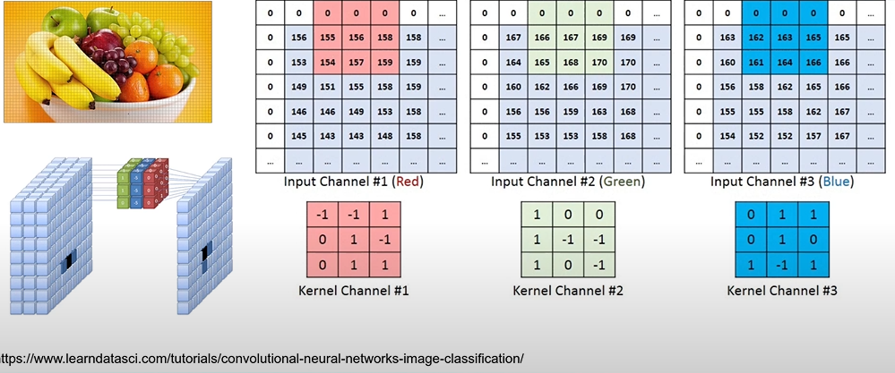

# **visão computacional**
## **qual sua função?**
- identificação
- classificação
- segmentação
## **no que é usado?**
- carros autonomos
- monitoramento da condição da estrada
- análise de raio-x
- detecção de cancer
- leitura de texto e códigos de barras
- montagem do produto
- detecção de EPI
- detecção precoce de pragas de insetos
- detecção de doenças de plantas
- levantamento arearo
- trafego de pedestres e contagem de pessoas

## **tipos de vião computacional**
- reconhecimento de objetos: identificação de objeto presente em imagens e védeos.
- classificação de image: recebe uma imagem como entrada e gera o rótulo de classificação dessa imagem.
- localização de objetos: algoritmo localiza a presença de objeto na imagem e o representa com uma caixa delimitadora.
- segmentação de imagem: é uma extensão adicioal da detecção de objetos na qual marcamos a presença de um objeto por meio de máscaras pixeladas geradas para cada objeto na imagem.

# **CNN**
## **por que usar uma CNN?**
- a CNN é constrída com várias camadas de convolução, camadas de agrupamento densas
- supopnha que temos uma imagem de 32 pixels com dimensões[32x32x3]. achatar essa matriz em um único vetor de entrada resultaria em uma matriz de 32x32x3 = 3.072 nós e pesos associados
- nossa imagem de fruteira pode não ser tão administrável. O nivelamento de suas dimensões resultaria em 682x400x3 = 818.400 valores. O tempo e o poder de computação simplesmente não favorecem essa abordagem para classificação de imagens

## **representação de imagem**
- na CNN, cada imagem é representada na forma de uma matriz de valores de pixel

⬆️ isso para imagens preto e branco, para imagens coloridas⬇️

## **!quais os componentes de uma cnn!**
- camada de entrada: os valores brutos de pixel de imagem representada como um amatriz 3D
- camada convolucional: os sprodutos escalares são calculados entre um conjunto de pesos(comumente chamado de filtro) e os valores associados a uma região local da entrada.
- Camada ReLu(Ativação): A camada ReLu determinará se um nó de entrada será 'disparado' dado os dados de entrada.
- Camada de Polling: uma estratégia de redução de amostragem é aplicada para reduzir a largura e a altura do volume de saída.
- Camada totalmente conectada: como as redes neurais convencionais, cada nó nesta camada está conectado a cada nó no volume de recursos sendo alimentados adiante